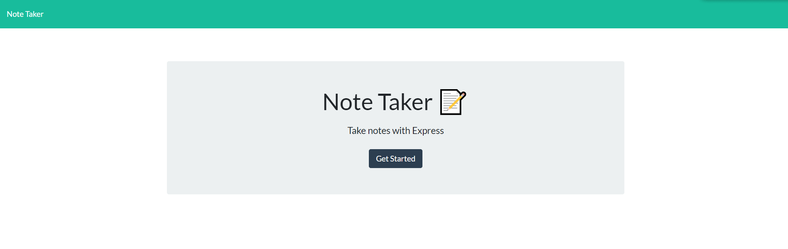
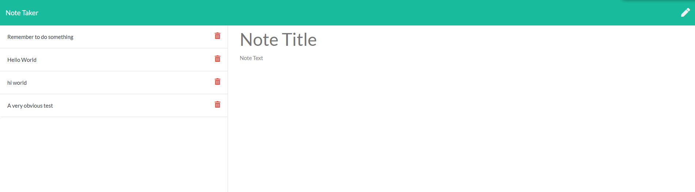

# QuickNote
This project is currently undergoing a facelift and will be updated frequently in the coming time. This is a work in progress!

  Live Deployment Link: COMING SOON
  
  ## Screenshots of Deployed Application:
  
  
  
  ## Table of Contents 
  - [Description](#description)
  - [Installation](#installation)
  - [Usage](#usage)
  - [Contact Information](#contact-information)

  ## Description:
  Ever wondering how to make a quick and easy note on the web? Look no further, that's provided here with the fantastical note taker! Created in effort to have a place to digitally store notes. Like all challenges this one pushed me and it took awhile to figure out if I've got everything working. To see it work as is, is a wonderful feeling and a reminder to myself that with enough time to trial and error you can get a neat reward at the end of it. So please, enjoy the note-taker!
  
### GIVEN a note-taking application
 - WHEN I open the Note Taker
   - THEN I am presented with a landing page with a link to a notes page
   
 - WHEN I click on the link to the notes page
   - THEN I am presented with a page with existing notes listed in the left-hand column, plus empty fields to enter a new note title and the note’s text in the right-hand column
 
 - WHEN I enter a new note title and the note’s text
   - THEN a Save icon appears in the navigation at the top of the page
 
 - WHEN I click on the Save icon
   - THEN the new note I have entered is saved and appears in the left-hand column with the other existing notes
 
 - WHEN I click on an existing note in the list in the left-hand column
   - THEN that note appears in the right-hand column
 
 - WHEN I click on the Write icon in the navigation at the top of the page
   - THEN I am presented with empty fields to enter a new note title and the note’s text in the right-hand column

  ## Installation:
  Install it through Github!

  ## Usage:
  - The `Note Header` will change based on current actions
    - Users will see a visual notification on the header based on adding/viewing a note
  - To create a note, click on the `pencil` emoji. The header will indicate when you can add a note.
  - When your note is capable of saving a `save emoji` (floppy-disk icon) will appear, clicking that will save your note
    - Saved notes will feature the note-title as it's list title.
  - Clicking a saved note will showcase the title and text.
  - Clicking the trash-can will delete an existing note
  
  ## Contact Information:
  - Github: [jwilferd10](https://github.com/jwilferd10)
  - Email: jwilferd10@yahoo.com 
